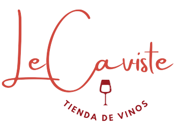
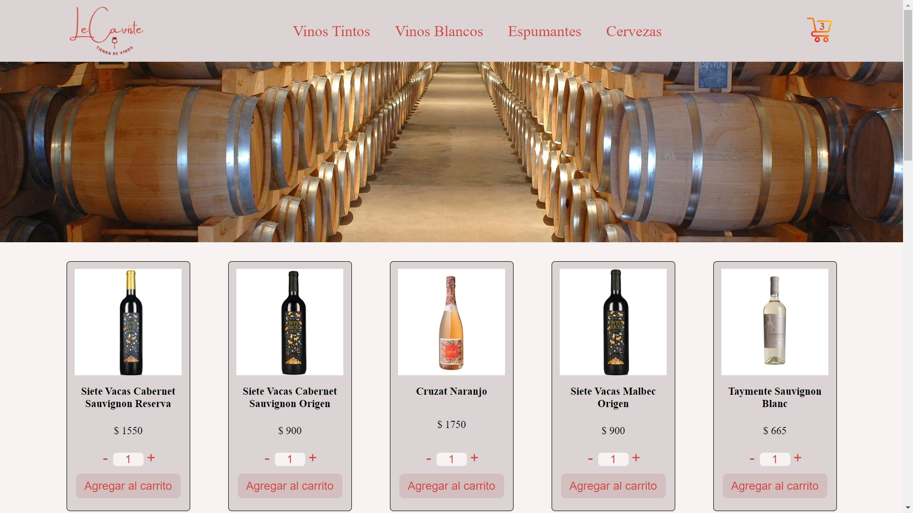

<p align="center">
    
</p >

# **Le Caviste - Tienda de vinos**

El proyecto es un E-Commerce desarrollado en React de venta de bebidas alcohólicas, principalmente vinos.

El proyecto busca mostrar un catálogo de productos, filtrar los mismos en diferentes categorias y mostrar un detalle con las características de cada uno de ellos.

La base de datos de los productos se encuentra alojada en Firestore y de alli se obtienen para su renderizado, asi mismo al realizarce una compra se guarda en dicho servicio los datos de la transacción.

Sus funcionalidades permiten al usuario elegir la cantidad de cada producto que desean comprar para agregarlos a un carrito de compras y finalizar la transacción.

## **Screenshots**

---

### Home



### Filtro productos


### Detalle productos


### Carrito


## **DEMO**

---


## **Dependencias Utilizadas**

---

- react-router-dom
- Firebase

## **Instalación**

---
```
$ git clone https://github.com/nlorences/lorences-proyecto-react.git
$ cd ../path/lorences-proyecto-react
$ npm install
$ npm run start
```


https://lorences-proyecto-react.vercel.app/

Nicolas Lorences.

Junio de 2022.
